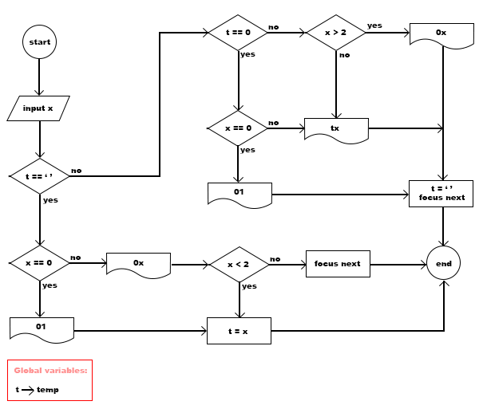
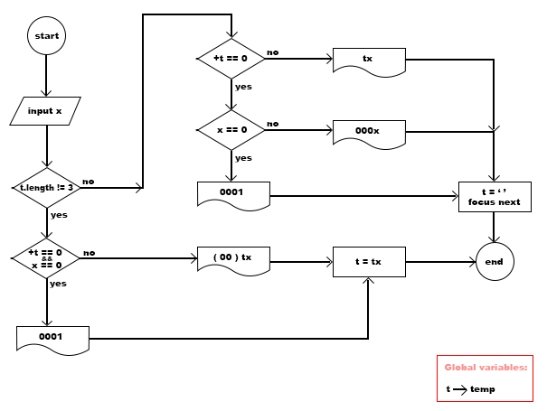

## Download and install package

```
npm i fast-date-typing
```
## Import

```
import { FastDateTyping } from 'fast-date-typing';
```
## How to use

```
import { Component } from '@angular/core';

@Component({
  selector: 'app-root',
  template: `
    <fast-date-typing [(value)]="stringDate" [separator]="'-'" (yearPrevFocus)="prevFocusTarget()" (dayNextFocus)="nextFocusTarget()"></fast-date-typing>
  `
})
export class AppComponent {
  stringDate = '2023-01-01';

  prevFocusTarget(){
    // after press shift+tab
  }

  nextFocusTarget(){
    // after press tab 
  }
}

```

## How it works

day flowchart


month flowchart



year flowchart




