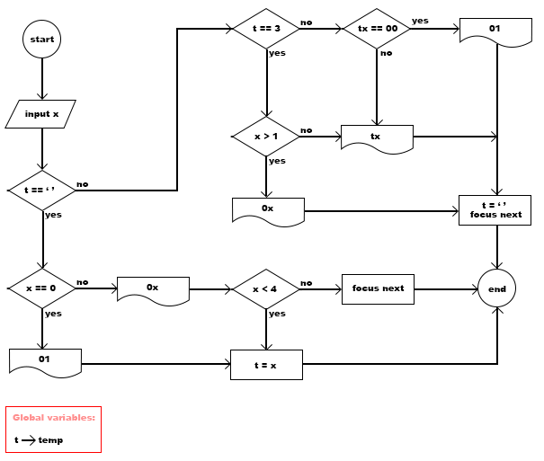

## Download and install package

```
npm i fast-date-typing
```
## Import

```
import { FastDateTyping } from 'fast-date-typing';
```
## How to use

```
<fast-date-typing [(value)]="'2023-01-01'" [separator]="'/'"></fast-date-typing>
```

## How it works

day flowchart



month flowchart


year flowchart


